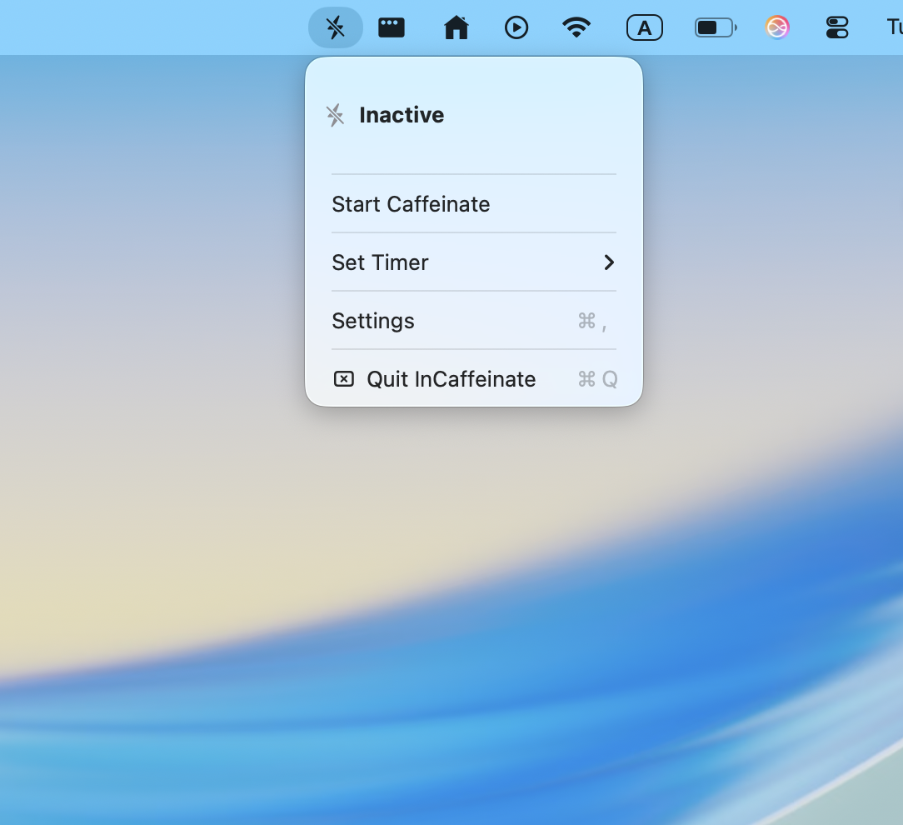
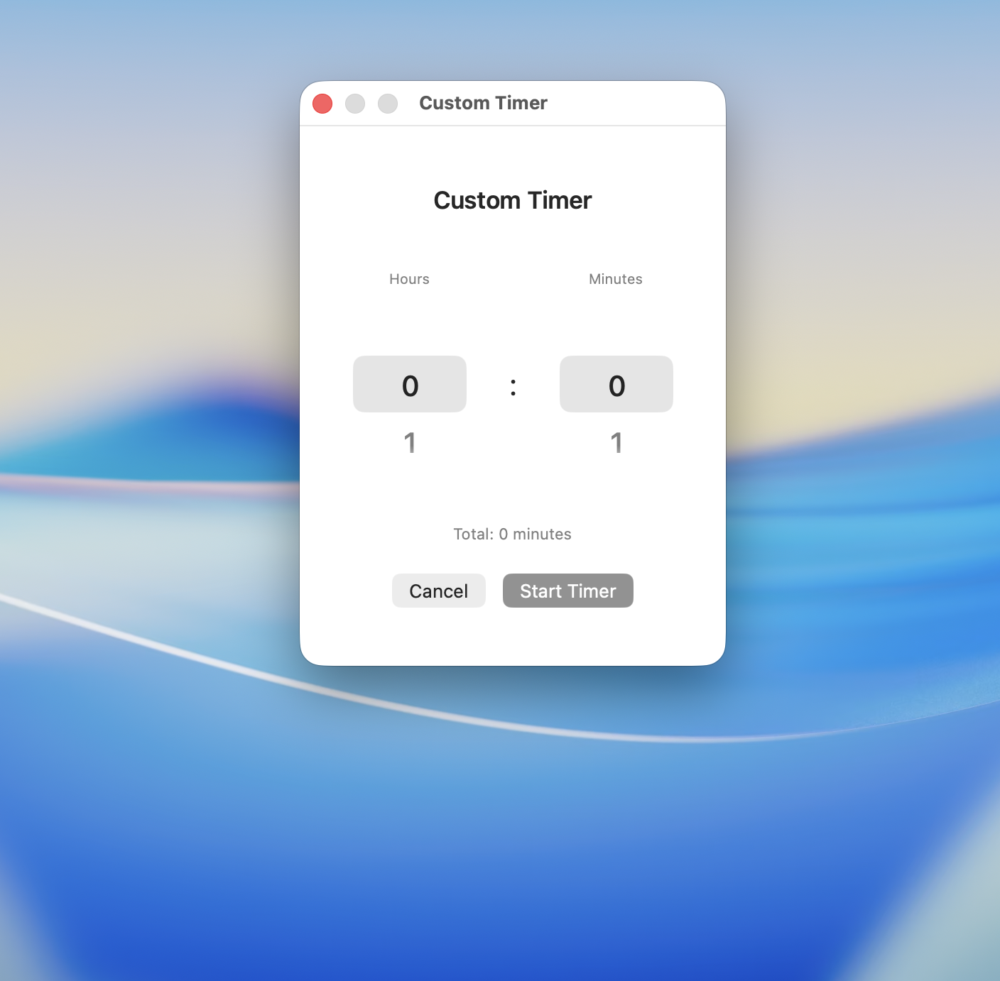
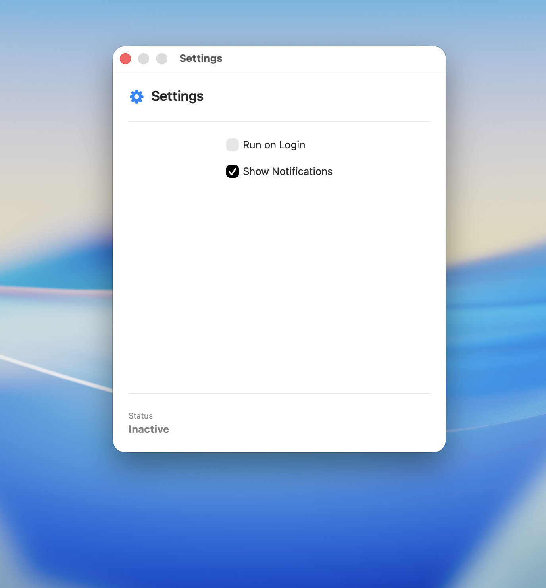

# InCaffeinate

A simple macOS menu bar utility to prevent your Mac from sleeping.


## Features

- 🚀 **One-click sleep prevention** - Instantly prevent your Mac from sleeping
- ⏰ **Flexible timer options** - 15 minutes, 30 minutes, 1 hour, or custom duration
- 📱 **Clean menu bar interface** - Minimal design that stays out of your way
- 🔄 **Start at login** - Option to automatically launch when you log in
- ⚡ **Lightweight and efficient** - Uses macOS native caffeinate command
- 🔔 **Smart notifications** - Get alerts when timers expire

## Quick Start

1. **Clone the repository**
   ```bash
   git clone https://github.com/dehshat12/InCaffeinate.git
   cd InCaffeinate
   ```

2. **Open in Xcode**
   ```bash
   open InCaffeinate.xcodeproj
   ```

3. **Build and run**
   - Select your development team in project settings
   - Press `Cmd+R` to build and run

## How It Works

InCaffeinate uses macOS's built-in `caffeinate` command to prevent system sleep:

- **Display sleep** - Prevents display from turning off
- **System sleep** - Stops system from entering sleep mode
- **Disk idle** - Prevents disk from spinning down
- **Timer mode** - Automatically stops after specified duration

## Usage

### Menu Bar Controls
Right-click the menu bar icon to access:

- **Start/Stop Caffeinate** - Toggle sleep prevention on/off
- **Set Timer** - Choose from preset durations or create custom timer
- **Settings** - Configure startup and notification preferences
- **Quit** - Exit the application



### Timer Options
- **15 minutes** - Quick short-term prevention
- **30 minutes** - Default duration for most tasks
- **1 hour** - For longer sessions
- **Custom** - Set any duration up to 24 hours



## Settings

Configure your preferences in the Settings window:

- **Run on Login** - Automatically start when you log in
- **Show Notifications** - Display alerts when timers expire



## Requirements

- macOS 14.6 or later

## Building

1. Clone the repository
2. Open `InCaffeinate.xcodeproj` in Xcode
3. Select your development team in project settings
4. Build (`Cmd+B`) or run (`Cmd+R`)

## License

This project is licensed under the MIT License - see the [LICENSE](LICENSE) file for details.

## Support

If you encounter any issues:

1. Check the [Troubleshooting](#troubleshooting) section
2. [Open an issue](https://github.com/dehshat12/InCaffeinate/issues)
3. Contact the developer

---

**Built with ❤️ using SwiftUI for modern macOS**
